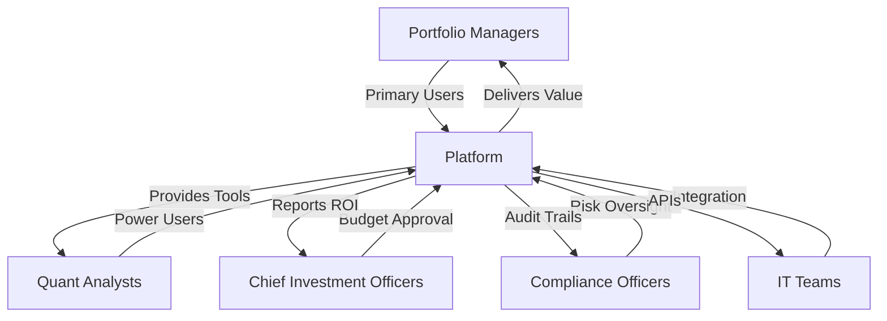
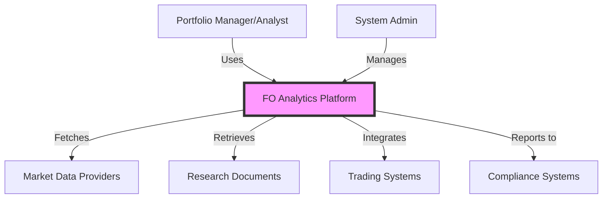
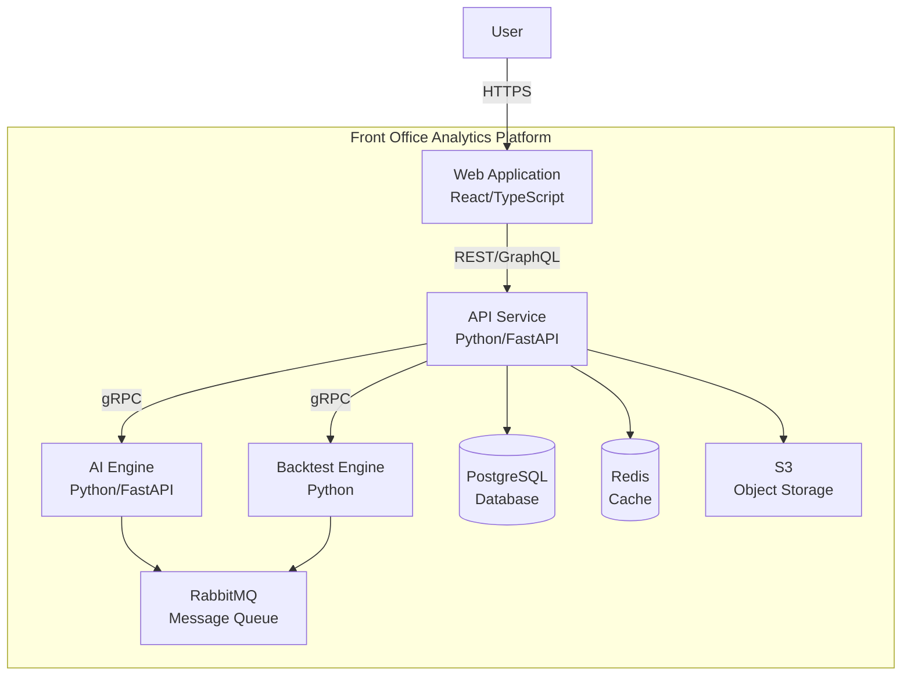
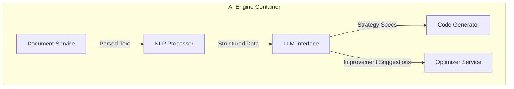
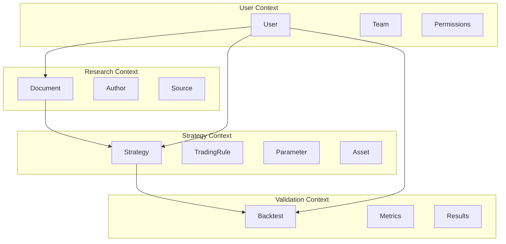
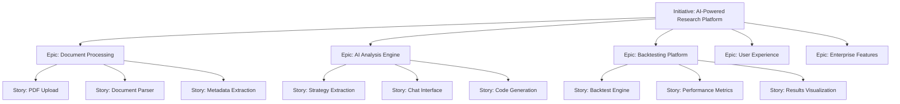
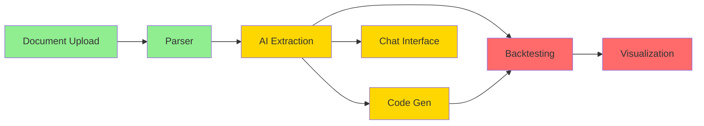
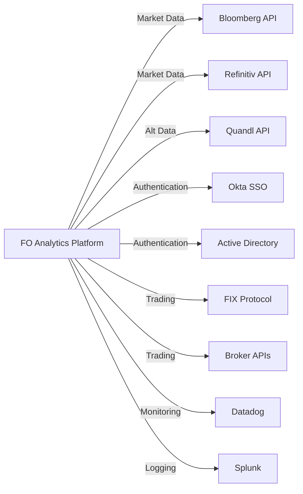

# Product Requirements Document: Front Office Analytics AI Platform

**Version 1.0**  
**Date: January 2025**  
**Document Status: Complete**

---

## Table of Contents

1. [Product Overview](#1-product-overview)
2. [User Research & Design](#2-user-research--design)
   - 2.1 [Design Thinking Process](#21-design-thinking-process)
   - 2.2 [User Story Map](#22-user-story-map)
   - 2.3 [Customer Journey Map](#23-customer-journey-map)
3. [Feature Specifications](#3-feature-specifications)
   - 3.1 [RICE-Prioritized Features](#31-rice-prioritized-features)
   - 3.2 [MECE Feature Architecture](#32-mece-feature-architecture)
   - 3.3 [System Architecture (C4 Model)](#33-system-architecture-c4-model)
4. [Technical Requirements](#4-technical-requirements)
   - 4.1 [API Specifications](#41-api-specifications)
   - 4.2 [Data Model (DDD)](#42-data-model-ddd)
   - 4.3 [Non-Functional Requirements](#43-non-functional-requirements)
5. [Implementation Plan](#5-implementation-plan)
   - 5.1 [Agile Release Planning](#51-agile-release-planning)
   - 5.2 [Technical Debt Management](#52-technical-debt-management)
   - 5.3 [DACI Decision Framework](#53-daci-decision-framework)
6. [Testing & Launch Strategy](#6-testing--launch-strategy)
7. [Appendices](#7-appendices)

---

## 1. Product Overview

### Vision Statement
Empower financial professionals to transform research insights into validated, profitable trading strategies in minutes, not weeks, through AI-powered analysis and automated backtesting.

### Mission Alignment
- **Democratize Quantitative Research**: Make sophisticated strategy validation accessible to all portfolio managers
- **Accelerate Alpha Discovery**: Reduce time-to-market for research-driven strategies by 90%
- **Ensure Systematic Excellence**: Provide institutional-grade validation for every investment decision

### Success Metrics and KPIs

| Metric Category | KPI | Target | Measurement Method |
|-----------------|-----|--------|-------------------|
| **Adoption** | Daily Active Users | 80% of licensed users | Platform analytics |
| **Performance** | Research Processing Time | <5 minutes per document | System monitoring |
| **Quality** | Strategy Reproduction Accuracy | 95%+ | Validation testing |
| **Business Impact** | Alpha Generated | $500M+ annually | Client reporting |
| **User Satisfaction** | Net Promoter Score | 9+ | Quarterly surveys |
| **Platform Reliability** | Uptime | 99.9% | Infrastructure monitoring |

### Stakeholder Map



---

## 2. User Research & Design

### 2.1 Design Thinking Process

#### Empathize: User Personas with Empathy Maps

**Persona 1: Sarah Chen - Senior Portfolio Manager**

| Dimension | Details |
|-----------|---------|
| **Demographics** | 38 years old, 15 years experience, manages $2B AUM |
| **Says** | "I need to validate every research idea before risking client capital" |
| **Thinks** | "Am I missing profitable opportunities in the research I receive?" |
| **Does** | Reviews 20+ research papers weekly, manually codes promising strategies |
| **Feels** | Overwhelmed by research volume, anxious about missing opportunities |
| **Pain Points** | - Takes 2-3 weeks to implement strategies<br>- Can't validate all interesting research<br>- Difficult to track what's been tested |
| **Gains** | - Rapid validation builds confidence<br>- More strategies tested = more alpha<br>- Clear audit trail for compliance |

**Persona 2: Marcus Rodriguez - Quantitative Analyst**

| Dimension | Details |
|-----------|---------|
| **Demographics** | 29 years old, PhD in Physics, 3 years in finance |
| **Says** | "I spend 80% of my time reimplementing published strategies" |
| **Thinks** | "There must be a better way to extract and test trading rules" |
| **Does** | Codes strategies in Python, runs extensive backtests, optimizes parameters |
| **Feels** | Frustrated by repetitive work, excited by model improvements |
| **Pain Points** | - Manual extraction is error-prone<br>- Backtesting infrastructure limitations<br>- No systematic way to improve models |
| **Gains** | - Automated extraction saves weeks<br>- AI suggestions spark innovation<br>- Focus on high-value optimization |

#### Define: Problem Statements (How Might We)

1. **HMW** reduce the time from research publication to validated trading strategy from weeks to hours?
2. **HMW** ensure 95%+ accuracy in extracting and implementing complex trading rules from research documents?
3. **HMW** help portfolio managers systematically track and leverage all validated strategies?
4. **HMW** use AI to suggest improvements that human analysts might miss?
5. **HMW** maintain compliance and audit trails without slowing down the research process?

#### Ideate: SCAMPER Solution Generation

**Substitute**
- Replace manual coding with AI-powered code generation
- Substitute traditional backtesting with cloud-based distributed processing

**Combine**
- Merge research analysis with immediate backtesting capability
- Integrate multiple data sources for comprehensive validation

**Adapt**
- Adapt NLP techniques from legal document analysis to financial research
- Apply gaming industry's instant feedback loops to strategy validation

**Modify/Magnify**
- Amplify human expertise with AI-suggested improvements
- Expand single-asset strategies to multi-asset automatically

**Put to Other Uses**
- Use extracted strategies for risk management
- Apply learnings to improve future research

**Eliminate**
- Remove manual transcription errors
- Eliminate waiting time between research and implementation

**Reverse/Rearrange**
- Start with desired outcomes and work backward to find research
- Continuous validation instead of batch processing

#### Prototype: MVP Definition (Build-Measure-Learn)

**Build (MVP Features)**
1. PDF research document upload and parsing
2. AI chat interface for research queries
3. Automated Python/R code generation
4. Basic backtesting with standard metrics
5. Simple results dashboard

**Measure**
- Time to process first document
- Accuracy of strategy extraction
- User engagement metrics
- Generated code quality

**Learn**
- User workflow preferences
- Most valuable features
- Performance bottlenecks
- Integration requirements

#### Test: Usability Testing Protocol

**Test Scenarios**
1. Upload and analyze a complex research paper
2. Query the AI about specific strategy details
3. Generate and run backtesting code
4. Interpret and export results
5. Search for previously validated strategies

**Success Criteria**
- Task completion rate >90%
- Time on task <10 minutes for basic workflow
- Error rate <5%
- User satisfaction score >4/5

### 2.2 User Story Map

#### Horizontal Backbone (User Activities)

```
Research Discovery → Document Analysis → Strategy Extraction → Validation → Implementation → Monitoring
```

#### Vertical Slices (User Tasks and Stories)

**Research Discovery**
- As a PM, I want to upload research documents in any format
- As a QA, I want to bulk import research from email/Bloomberg
- As a team lead, I want to see what research my team is analyzing

**Document Analysis**
- As a PM, I want AI to summarize key strategy points
- As a QA, I want to extract all quantitative parameters
- As a compliance officer, I want to track document sources

**Strategy Extraction**
- As a QA, I want executable code in my preferred language
- As a PM, I want plain English explanation of the strategy
- As a risk manager, I want to understand strategy assumptions

**Validation**
- As a PM, I want to see if results match the paper's claims
- As a QA, I want to run sensitivity analysis
- As a CIO, I want to compare against our existing strategies

**Implementation**
- As a PM, I want one-click deployment to paper trading
- As a QA, I want to integrate with our execution systems
- As IT, I want secure API access

**Monitoring**
- As a PM, I want real-time performance tracking
- As a risk manager, I want alerts on anomalies
- As a CIO, I want attribution analysis

#### Walking Skeleton (MVP)
1. Upload PDF → Extract Strategy → Generate Python Code → Run Backtest → View Results

#### Release Boundaries
- **Release 1**: Walking skeleton + basic features
- **Release 2**: Multi-asset support + AI improvements
- **Release 3**: Knowledge base + advanced analytics
- **Release 4**: Real-time monitoring + integrations

### 2.3 Customer Journey Map

#### End-to-End Journey: From Research Receipt to Live Trading

**Stage 1: Research Discovery** (Current: 2 hours)
- **Touchpoints**: Email, Bloomberg terminal, research portals
- **User Actions**: Receive research, initial review, flag interesting papers
- **Emotions**: Curious but overwhelmed
- **Pain Points**: Too much content, unclear which to prioritize
- **Opportunities**: AI-powered relevance scoring, automated flagging

**Stage 2: Deep Analysis** (Current: 4-8 hours)
- **Touchpoints**: PDF reader, Excel, notepad
- **User Actions**: Read thoroughly, extract key points, identify strategies
- **Emotions**: Focused but frustrated by manual process
- **Pain Points**: Complex strategies hard to extract, easy to miss details
- **Opportunities**: AI extraction, interactive querying, visual summaries

**Stage 3: Strategy Coding** (Current: 1-2 weeks)
- **Touchpoints**: IDE, Python/R, internal libraries
- **User Actions**: Write code, debug, validate logic
- **Emotions**: Technically challenged, worried about errors
- **Pain Points**: Time-consuming, error-prone, requires technical skills
- **Opportunities**: Automated code generation, multiple language support

**Stage 4: Backtesting** (Current: 2-3 days)
- **Touchpoints**: Backtesting platform, data sources
- **User Actions**: Configure parameters, run tests, analyze results
- **Emotions**: Anxious about accuracy, excited about results
- **Pain Points**: Slow processing, limited scenarios, data quality issues
- **Opportunities**: Cloud-scale processing, automated parameter sweeps

**Stage 5: Decision Making** (Current: 1-2 days)
- **Touchpoints**: Reports, committee meetings, risk systems
- **User Actions**: Present findings, get approval, document decision
- **Emotions**: Confident with data, concerned about missing factors
- **Pain Points**: Manual report creation, difficult to compare strategies
- **Opportunities**: Automated reporting, AI-powered insights, comparison tools

**Stage 6: Implementation** (Current: 1 week)
- **Touchpoints**: Trading systems, risk management, compliance
- **User Actions**: Deploy strategy, set limits, monitor initial performance
- **Emotions**: Excited but cautious
- **Pain Points**: Integration complexity, manual monitoring
- **Opportunities**: One-click deployment, automated monitoring, real-time alerts

#### Service Blueprint for Critical Interaction: Strategy Extraction

| Layer | Components |
|-------|-----------|
| **Physical Evidence** | Web interface, uploaded PDF, progress indicators, extracted code display |
| **Customer Actions** | Upload document → Select extraction options → Review results → Download code |
| **Frontstage** | Upload interface, AI chat, results dashboard, code editor |
| **Backstage** | PDF parser, NLP engine, LLM processor, code generator, validation service |
| **Support Processes** | Cloud infrastructure, monitoring, logging, error handling, queue management |

---

## 3. Feature Specifications

### 3.1 RICE-Prioritized Features

| Feature | Reach (users/quarter) | Impact | Confidence | Effort (PM) | RICE Score | Priority |
|---------|---------------------|---------|------------|-------------|------------|----------|
| AI Research Extraction | 1000 | Massive (3) | High (100%) | 3 | 1000 | P0 |
| Automated Backtesting | 1000 | Massive (3) | High (100%) | 4 | 750 | P0 |
| Multi-language Code Gen | 800 | High (2) | High (100%) | 2 | 800 | P0 |
| AI Chat Interface | 1000 | High (2) | High (100%) | 1.5 | 1333 | P0 |
| Knowledge Base | 600 | High (2) | Medium (80%) | 3 | 320 | P1 |
| Model Improvement AI | 400 | Massive (3) | Medium (80%) | 4 | 240 | P1 |
| Real-time Monitoring | 300 | Medium (1) | High (100%) | 3 | 100 | P2 |
| Mobile App | 200 | Low (0.5) | Medium (80%) | 4 | 20 | P3 |

### 3.2 MECE Feature Architecture

```
Front Office Analytics Platform
├── Research Processing [Mutually Exclusive]
│   ├── Document Ingestion
│   │   ├── PDF Parser
│   │   ├── HTML Extractor  
│   │   ├── Word Processor
│   │   └── Email Integration
│   ├── Content Analysis
│   │   ├── Strategy Extraction
│   │   ├── Parameter Identification
│   │   ├── Asset Classification
│   │   └── Methodology Detection
│   └── Knowledge Synthesis
│       ├── Summary Generation
│       ├── Key Insights
│       ├── Risk Factors
│       └── Implementation Notes
│
├── AI Capabilities [Collectively Exhaustive]
│   ├── Conversational AI
│   │   ├── Research Q&A
│   │   ├── Strategy Clarification
│   │   ├── Implementation Guidance
│   │   └── Results Interpretation
│   ├── Code Generation
│   │   ├── Python Generation
│   │   └── SQL Generation
│   └── Model Enhancement
│       ├── Parameter Optimization
│       ├── Feature Engineering
│       ├── Risk Adjustment
│       └── Alternative Data Integration
│
├── Validation Engine [Mutually Exclusive]
│   ├── Backtesting Core
│   │   ├── Historical Simulation
│   │   ├── Transaction Modeling
│   │   ├── Market Impact
│   │   └── Slippage Calculation
│   ├── Performance Analytics
│   │   ├── Return Metrics
│   │   ├── Risk Metrics
│   │   ├── Attribution Analysis
│   │   └── Scenario Analysis
│   └── Comparison Tools
│       ├── Benchmark Comparison
│       ├── Strategy Ranking
│       ├── Peer Analysis
│       └── Time Period Analysis
│
└── Platform Services [Collectively Exhaustive]
    ├── User Management
    │   ├── Authentication
    │   ├── Authorization
    │   ├── Team Collaboration
    │   └── Audit Logging
    ├── Data Management
    │   ├── Market Data
    │   ├── Alternative Data
    │   ├── Research Library
    │   └── Results Storage
    └── Integration Layer
        ├── API Gateway
        ├── Webhook System
        ├── Data Connectors
        └── Export Services
```

### 3.3 System Architecture (C4 Model)

#### Context Diagram



#### Container Diagram



#### Component Diagram (AI Engine)



#### Code Level (Critical Algorithm - Strategy Extraction)

```python
class StrategyExtractor:
    def __init__(self, llm_client: LLMClient, nlp_processor: NLPProcessor):
        self.llm = llm_client
        self.nlp = nlp_processor
        
    async def extract_strategy(self, document: Document) -> Strategy:
        # Step 1: Preprocess document
        sections = self.nlp.segment_document(document)
        
        # Step 2: Identify strategy sections
        strategy_sections = []
        for section in sections:
            if self._is_strategy_section(section):
                strategy_sections.append(section)
        
        # Step 3: Extract parameters using LLM
        prompt = self._build_extraction_prompt(strategy_sections)
        llm_response = await self.llm.complete(prompt)
        
        # Step 4: Parse and validate
        raw_strategy = self._parse_llm_response(llm_response)
        validated_strategy = self._validate_strategy(raw_strategy)
        
        # Step 5: Generate confidence scores
        confidence = self._calculate_confidence(
            document, validated_strategy
        )
        
        return Strategy(
            rules=validated_strategy.rules,
            parameters=validated_strategy.parameters,
            assets=validated_strategy.assets,
            confidence=confidence
        )
    
    def _is_strategy_section(self, section: Section) -> bool:
        keywords = ['strategy', 'trading rule', 'signal', 'algorithm']
        return any(kw in section.text.lower() for kw in keywords)
    
    def _calculate_confidence(self, doc: Document, strategy: Strategy) -> float:
        # Confidence based on:
        # - Clarity of rules (40%)
        # - Parameter specificity (30%)
        # - Backtesting presence (20%)
        # - Author credibility (10%)
        
        clarity_score = self._assess_clarity(strategy.rules)
        param_score = self._assess_parameters(strategy.parameters)
        backtest_score = 1.0 if doc.has_backtesting else 0.5
        author_score = self._check_author_credibility(doc.authors)
        
        return (0.4 * clarity_score + 
                0.3 * param_score + 
                0.2 * backtest_score + 
                0.1 * author_score)
```

---

## 4. Technical Requirements

### 4.1 API Specifications

#### RESTful API Design

**Base URL**: `https://api.foanalytics.com/v1`

**Authentication**: Bearer token (JWT) with refresh token rotation

#### Core Resources

**1. Research Documents**

```yaml
/documents:
  post:
    summary: Upload research document
    requestBody:
      content:
        multipart/form-data:
          schema:
            type: object
            properties:
              file:
                type: string
                format: binary
              metadata:
                type: object
                properties:
                  source: string
                  authors: array
                  publishDate: string
    responses:
      201:
        content:
          application/json:
            schema:
              $ref: '#/components/schemas/Document'
              
  get:
    summary: List documents
    parameters:
      - in: query
        name: status
        schema:
          type: string
          enum: [processing, completed, failed]
      - in: query
        name: dateFrom
        schema:
          type: string
          format: date
    responses:
      200:
        content:
          application/json:
            schema:
              type: array
              items:
                $ref: '#/components/schemas/DocumentSummary'

/documents/{documentId}:
  get:
    summary: Get document details
    parameters:
      - in: path
        name: documentId
        required: true
        schema:
          type: string
    responses:
      200:
        content:
          application/json:
            schema:
              $ref: '#/components/schemas/Document'

/documents/{documentId}/strategies:
  get:
    summary: Get extracted strategies
    responses:
      200:
        content:
          application/json:
            schema:
              type: array
              items:
                $ref: '#/components/schemas/Strategy'
```

**2. AI Interactions**

```yaml
/ai/chat:
  post:
    summary: Chat with AI about research
    requestBody:
      content:
        application/json:
          schema:
            type: object
            properties:
              documentId: string
              message: string
              context:
                type: array
                items:
                  type: object
                  properties:
                    role: string
                    content: string
    responses:
      200:
        content:
          application/json:
            schema:
              type: object
              properties:
                response: string
                suggestions:
                  type: array
                  items:
                    type: string
                relevantSections:
                  type: array
                  items:
                    $ref: '#/components/schemas/DocumentSection'

/ai/generate-code:
  post:
    summary: Generate implementation code
    requestBody:
      content:
        application/json:
          schema:
            type: object
            properties:
              strategyId: string
              language: 
                type: string
                enum: [python, r, cpp, java]
              framework:
                type: string
                enum: [pandas, numpy, quantlib, custom]
    responses:
      200:
        content:
          application/json:
            schema:
              type: object
              properties:
                code: string
                dependencies:
                  type: array
                  items:
                    type: string
                setup_instructions: string
                
/ai/improve:
  post:
    summary: Get AI improvement suggestions
    requestBody:
      content:
        application/json:
          schema:
            type: object
            properties:
              strategyId: string
              optimizationGoal:
                type: string
                enum: [sharpe, returns, risk, drawdown]
              constraints:
                type: object
    responses:
      200:
        content:
          application/json:
            schema:
              type: array
              items:
                $ref: '#/components/schemas/Improvement'
```

**3. Backtesting**

```yaml
/backtests:
  post:
    summary: Create new backtest
    requestBody:
      content:
        application/json:
          schema:
            type: object
            properties:
              strategyId: string
              config:
                type: object
                properties:
                  startDate: string
                  endDate: string
                  initialCapital: number
                  assets:
                    type: array
                    items:
                      type: string
                  executionConfig:
                    $ref: '#/components/schemas/ExecutionConfig'
    responses:
      201:
        content:
          application/json:
            schema:
              $ref: '#/components/schemas/BacktestJob'

/backtests/{backtestId}:
  get:
    summary: Get backtest status and results
    responses:
      200:
        content:
          application/json:
            schema:
              $ref: '#/components/schemas/BacktestResult'

/backtests/{backtestId}/metrics:
  get:
    summary: Get detailed performance metrics
    responses:
      200:
        content:
          application/json:
            schema:
              type: object
              properties:
                returns:
                  $ref: '#/components/schemas/ReturnMetrics'
                risk:
                  $ref: '#/components/schemas/RiskMetrics'
                execution:
                  $ref: '#/components/schemas/ExecutionMetrics'
```

#### GraphQL Alternative

```graphql
type Query {
  document(id: ID!): Document
  documents(
    filter: DocumentFilter
    pagination: PaginationInput
  ): DocumentConnection!
  
  strategy(id: ID!): Strategy
  strategies(
    documentId: ID
    filter: StrategyFilter
  ): [Strategy!]!
  
  backtest(id: ID!): Backtest
  backtests(
    strategyId: ID
    status: BacktestStatus
  ): [Backtest!]!
}

type Mutation {
  uploadDocument(
    file: Upload!
    metadata: DocumentMetadataInput
  ): Document!
  
  extractStrategies(
    documentId: ID!
    options: ExtractionOptions
  ): [Strategy!]!
  
  generateCode(
    strategyId: ID!
    language: CodeLanguage!
    options: CodeGenOptions
  ): GeneratedCode!
  
  runBacktest(
    strategyId: ID!
    config: BacktestConfig!
  ): Backtest!
  
  improveStrategy(
    strategyId: ID!
    goal: OptimizationGoal!
  ): [Improvement!]!
}

type Subscription {
  documentProcessing(documentId: ID!): DocumentStatus!
  backtestProgress(backtestId: ID!): BacktestProgress!
}

type Document {
  id: ID!
  title: String!
  authors: [String!]!
  uploadDate: DateTime!
  status: ProcessingStatus!
  strategies: [Strategy!]!
  insights: [Insight!]!
}

type Strategy {
  id: ID!
  document: Document!
  name: String!
  description: String!
  rules: [TradingRule!]!
  parameters: JSON!
  assets: [Asset!]!
  confidence: Float!
  code(language: CodeLanguage!): GeneratedCode
  backtests: [Backtest!]!
  improvements: [Improvement!]!
}
```

### 4.2 Data Model (Domain-Driven Design)

#### Bounded Contexts



#### Aggregates and Entities

**Document Aggregate**
```typescript
// Aggregate Root
class Document {
  id: DocumentId;
  title: string;
  authors: Author[];
  source: Source;
  uploadedBy: UserId;
  uploadDate: Date;
  status: ProcessingStatus;
  content: DocumentContent;
  metadata: DocumentMetadata;
  
  // Domain Events
  events: DomainEvent[] = [];
  
  // Business Logic
  markAsProcessed(extractedStrategies: Strategy[]): void {
    if (this.status !== ProcessingStatus.PROCESSING) {
      throw new InvalidStateError();
    }
    this.status = ProcessingStatus.COMPLETED;
    this.events.push(new DocumentProcessedEvent(this.id, extractedStrategies));
  }
  
  validateForProcessing(): ValidationResult {
    const errors = [];
    if (!this.content) errors.push("No content available");
    if (this.content.pageCount > 500) errors.push("Document too large");
    if (!this.isSupportedFormat()) errors.push("Unsupported format");
    return new ValidationResult(errors);
  }
}

// Value Objects
class DocumentId {
  constructor(private readonly value: string) {
    if (!this.isValid(value)) {
      throw new InvalidDocumentIdError(value);
    }
  }
  
  private isValid(value: string): boolean {
    return /^DOC-[A-Z0-9]{8}$/.test(value);
  }
  
  toString(): string {
    return this.value;
  }
}

class Author {
  constructor(
    public readonly name: string,
    public readonly affiliation?: string,
    public readonly email?: string
  ) {}
  
  equals(other: Author): boolean {
    return this.name === other.name && 
           this.affiliation === other.affiliation;
  }
}
```

**Strategy Aggregate**
```typescript
// Aggregate Root
class Strategy {
  id: StrategyId;
  documentId: DocumentId;
  name: string;
  description: string;
  rules: TradingRule[];
  parameters: ParameterSet;
  targetAssets: Asset[];
  confidence: ConfidenceScore;
  extractedAt: Date;
  version: number;
  
  // Invariants
  validate(): void {
    if (this.rules.length === 0) {
      throw new NoRulesDefinedError();
    }
    if (!this.parameters.isComplete()) {
      throw new IncompleteParametersError();
    }
    if (this.confidence.value < 0.5) {
      throw new LowConfidenceError();
    }
  }
  
  // Domain Logic
  generateCode(language: Language): GeneratedCode {
    const generator = CodeGeneratorFactory.create(language);
    return generator.generate(this);
  }
  
  suggestImprovements(goal: OptimizationGoal): Improvement[] {
    const optimizer = new StrategyOptimizer(this);
    return optimizer.suggest(goal);
  }
}

// Entities
class TradingRule {
  id: RuleId;
  type: RuleType;
  condition: Condition;
  action: Action;
  priority: number;
  
  evaluate(marketData: MarketData): Signal {
    if (this.condition.isMet(marketData)) {
      return this.action.toSignal();
    }
    return Signal.NONE;
  }
}

// Value Objects
class ParameterSet {
  private parameters: Map<string, Parameter>;
  
  constructor(params: Parameter[]) {
    this.parameters = new Map(
      params.map(p => [p.name, p])
    );
  }
  
  get(name: string): Parameter | undefined {
    return this.parameters.get(name);
  }
  
  isComplete(): boolean {
    return Array.from(this.parameters.values())
      .every(p => p.hasValue());
  }
  
  optimize(ranges: ParameterRanges): ParameterSet {
    // Optimization logic
  }
}

class ConfidenceScore {
  constructor(public readonly value: number) {
    if (value < 0 || value > 1) {
      throw new InvalidConfidenceError(value);
    }
  }
  
  isHigh(): boolean {
    return this.value >= 0.8;
  }
  
  isMedium(): boolean {
    return this.value >= 0.6 && this.value < 0.8;
  }
  
  isLow(): boolean {
    return this.value < 0.6;
  }
}
```

**Backtest Aggregate**
```typescript
// Aggregate Root
class Backtest {
  id: BacktestId;
  strategyId: StrategyId;
  config: BacktestConfig;
  status: BacktestStatus;
  startedAt: Date;
  completedAt?: Date;
  results?: BacktestResults;
  
  // State Machine
  start(): void {
    if (this.status !== BacktestStatus.PENDING) {
      throw new InvalidStateTransitionError();
    }
    this.status = BacktestStatus.RUNNING;
    this.startedAt = new Date();
  }
  
  complete(results: BacktestResults): void {
    if (this.status !== BacktestStatus.RUNNING) {
      throw new InvalidStateTransitionError();
    }
    this.validateResults(results);
    this.status = BacktestStatus.COMPLETED;
    this.completedAt = new Date();
    this.results = results;
  }
  
  fail(error: Error): void {
    this.status = BacktestStatus.FAILED;
    this.completedAt = new Date();
  }
  
  private validateResults(results: BacktestResults): void {
    if (!results.hasRequiredMetrics()) {
      throw new IncompleteResultsError();
    }
  }
}

// Value Objects
class BacktestConfig {
  constructor(
    public readonly startDate: Date,
    public readonly endDate: Date,
    public readonly initialCapital: Money,
    public readonly executionModel: ExecutionModel,
    public readonly dataFrequency: DataFrequency
  ) {
    this.validate();
  }
  
  private validate(): void {
    if (this.endDate <= this.startDate) {
      throw new InvalidDateRangeError();
    }
    if (this.initialCapital.amount <= 0) {
      throw new InvalidCapitalError();
    }
  }
}

class BacktestResults {
  constructor(
    public readonly trades: Trade[],
    public readonly equity: EquityCurve,
    public readonly metrics: PerformanceMetrics
  ) {}
  
  hasRequiredMetrics(): boolean {
    return this.metrics.hasReturns() &&
           this.metrics.hasRiskMetrics() &&
           this.metrics.hasDrawdown();
  }
}
```

#### Domain Events

```typescript
abstract class DomainEvent {
  public readonly occurredAt: Date = new Date();
  public readonly aggregateId: string;
  
  constructor(aggregateId: string) {
    this.aggregateId = aggregateId;
  }
}

class DocumentUploadedEvent extends DomainEvent {
  constructor(
    documentId: string,
    public readonly uploadedBy: string
  ) {
    super(documentId);
  }
}

class StrategyExtractedEvent extends DomainEvent {
  constructor(
    documentId: string,
    public readonly strategyId: string,
    public readonly confidence: number
  ) {
    super(documentId);
  }
}

class BacktestCompletedEvent extends DomainEvent {
  constructor(
    backtestId: string,
    public readonly strategyId: string,
    public readonly sharpeRatio: number
  ) {
    super(backtestId);
  }
}

class ImprovementSuggestedEvent extends DomainEvent {
  constructor(
    strategyId: string,
    public readonly improvementType: string,
    public readonly expectedImprovement: number
  ) {
    super(strategyId);
  }
}
```

#### Ubiquitous Language Glossary

| Term | Definition | Context |
|------|-----------|---------|
| **Strategy** | A set of trading rules extracted from research | Strategy Context |
| **Backtest** | Historical simulation of strategy performance | Validation Context |
| **Document** | Research paper or report containing strategies | Research Context |
| **Extraction** | AI process of identifying strategies in documents | Strategy Context |
| **Confidence Score** | AI's certainty about extracted strategy accuracy | Strategy Context |
| **Parameter** | Configurable value in a trading strategy | Strategy Context |
| **Trading Rule** | Condition-action pair defining trade logic | Strategy Context |
| **Equity Curve** | Time series of portfolio value | Validation Context |
| **Sharpe Ratio** | Risk-adjusted return metric | Validation Context |
| **Drawdown** | Peak-to-trough decline in portfolio value | Validation Context |
| **Signal** | Trading instruction (buy/sell/hold) | Strategy Context |
| **Slippage** | Difference between expected and actual execution price | Validation Context |

### 4.3 Non-Functional Requirements Matrix

#### Performance Requirements

| Metric | Requirement | Measurement Method | Acceptance Criteria |
|--------|-------------|-------------------|-------------------|
| **Response Time** | | | |
| API Response (p50) | <100ms | APM monitoring | 95% compliance |
| API Response (p95) | <500ms | APM monitoring | 95% compliance |
| API Response (p99) | <2s | APM monitoring | 90% compliance |
| Document Processing | <5 min | End-to-end timing | 90% of documents |
| Backtest Execution | <30s per year of data | System monitoring | 95% compliance |
| **Throughput** | | | |
| Concurrent Users | 1000 | Load testing | No degradation |
| Documents/Hour | 500 | Stress testing | Stable processing |
| Backtests/Hour | 10,000 | Queue monitoring | No backlog >10min |
| API Requests/Second | 1000 | Load balancer metrics | <1% error rate |
| **Resource Usage** | | | |
| CPU Utilization | <70% average | CloudWatch | Alert at 80% |
| Memory Usage | <80% average | CloudWatch | Alert at 90% |
| Storage Growth | <1TB/month | S3 metrics | Capacity planning |

#### Scalability Requirements

| Dimension | Target | Implementation | Validation |
|-----------|--------|----------------|------------|
| **Horizontal Scaling** | | | |
| Web Tier | Auto-scale 2-20 instances | Kubernetes HPA | Load testing |
| API Tier | Auto-scale 5-50 instances | Kubernetes HPA | Load testing |
| AI Workers | Auto-scale 10-100 instances | Custom autoscaler | Queue depth |
| **Vertical Scaling** | | | |
| Database | Up to 64 vCPU | RDS scaling | Benchmark testing |
| Cache | Up to 100GB RAM | ElastiCache | Memory monitoring |
| **Data Scaling** | | | |
| Documents | 1M+ documents | Sharded storage | Performance testing |
| Users | 10,000+ concurrent | Connection pooling | Load testing |
| Historical Data | 50+ years | Partitioned tables | Query performance |

#### Security Requirements

| Category | Requirement | Implementation | Compliance |
|----------|-------------|----------------|------------|
| **Authentication** | | | |
| Method | SSO + MFA | SAML 2.0 / OAuth 2.0 | SOC 2 |
| Session Management | 8-hour timeout | JWT with refresh | NIST 800-63 |
| Password Policy | 14+ chars, complexity | Enforced at IdP | Corporate policy |
| **Authorization** | | | |
| Model | RBAC + ABAC | Custom implementation | Least privilege |
| Audit | All access logged | CloudTrail + custom | SOC 2 |
| **Encryption** | | | |
| In Transit | TLS 1.3 | ALB termination | PCI DSS |
| At Rest | AES-256 | KMS integration | SOC 2 |
| Key Management | Automated rotation | AWS KMS | Annual rotation |
| **Data Protection** | | | |
| PII Handling | Tokenization | Custom service | GDPR |
| Data Retention | 7 years | Automated lifecycle | Regulatory |
| Right to Delete | Within 30 days | Automated process | GDPR |

#### Reliability Requirements

| Metric | Target | Implementation | Monitoring |
|--------|--------|----------------|------------|
| **Availability** | | | |
| Platform Uptime | 99.9% | Multi-AZ deployment | Synthetics |
| Data Durability | 99.999999999% | S3 + backup | Backup testing |
| **Recovery** | | | |
| RTO (Major Outage) | 4 hours | Automated failover | DR drills |
| RPO (Data Loss) | 1 hour | Continuous backup | Backup testing |
| **Fault Tolerance** | | | |
| Component Failure | No user impact | Circuit breakers | Chaos testing |
| AZ Failure | Automatic failover | Multi-AZ | Failover testing |
| Region Failure | Manual failover | Cross-region backup | Annual DR test |

#### Usability Requirements

| Aspect | Requirement | Implementation | Validation |
|--------|-------------|----------------|------------|
| **Accessibility** | | | |
| Standard | WCAG 2.1 AA | React accessibility | Automated testing |
| Screen Readers | Full support | ARIA labels | Manual testing |
| Keyboard Navigation | 100% functionality | Focus management | User testing |
| **Internationalization** | | | |
| Languages | English, Mandarin, Japanese | i18n framework | Native speakers |
| Number Formats | Locale-specific | Intl API | Regional testing |
| Date/Time | User timezone | Moment.js | User preference |
| **Performance Perception** | | | |
| Page Load | <3s perceived | Progressive rendering | User testing |
| Feedback | <100ms for actions | Optimistic updates | Perception study |
| Progress Indicators | For >2s operations | Real-time updates | User feedback |

---

## 5. Implementation Plan

### 5.1 Agile Release Planning

#### Epic Hierarchy



#### Story Breakdown with Points

**Epic 1: Document Processing (21 points)**

| Story | Description | Points | Acceptance Criteria |
|-------|-------------|--------|-------------------|
| PDF Upload | Multi-file upload with progress | 5 | - Supports files up to 100MB<br>- Shows upload progress<br>- Validates file type |
| Document Parser | Extract text and structure | 8 | - 95%+ accuracy on standard PDFs<br>- Handles tables and figures<br>- Preserves formatting |
| Metadata Extraction | Auto-extract title, authors, date | 8 | - Identifies all standard metadata<br>- Allows manual override<br>- Stores in searchable format |

**Epic 2: AI Analysis Engine (34 points)**

| Story | Description | Points | Acceptance Criteria |
|-------|-------------|--------|-------------------|
| Strategy Extraction | Identify trading rules via AI | 13 | - Extracts complete strategies<br>- Includes all parameters<br>- Confidence scoring |
| Chat Interface | Natural language Q&A | 8 | - Context-aware responses<br>- Cites sources<br>- Maintains conversation |
| Code Generation | Generate executable code | 13 | - Python and R support<br>- Runnable without modification<br>- Includes dependencies |

**Epic 3: Backtesting Platform (34 points)**

| Story | Description | Points | Acceptance Criteria |
|-------|-------------|--------|-------------------|
| Backtest Engine | Run historical simulations | 13 | - Accurate price execution<br>- Transaction costs<br>- Realistic slippage |
| Performance Metrics | Calculate standard metrics | 8 | - Sharpe, Sortino, Calmar<br>- Drawdown analysis<br>- Return attribution |
| Results Visualization | Interactive charts and tables | 13 | - Equity curve<br>- Trade analysis<br>- Risk metrics |

#### Release Train Schedule

**PI 1: Foundation (Q1 2025)**
- Sprint 1-2: Infrastructure setup, basic upload
- Sprint 3-4: Document processing, simple extraction
- Sprint 5-6: Basic backtesting, initial UI

**PI 2: Core Features (Q2 2025)**
- Sprint 7-8: Advanced extraction, chat interface
- Sprint 9-10: Code generation, enhanced backtesting
- Sprint 11-12: Performance optimization, testing

**PI 3: Enhancement (Q3 2025)**
- Sprint 13-14: AI improvements, knowledge base
- Sprint 15-16: Multi-asset support, advanced metrics
- Sprint 17-18: Integration APIs, enterprise features

**PI 4: Scale (Q4 2025)**
- Sprint 19-20: Performance tuning, reliability
- Sprint 21-22: Advanced features, mobile app
- Sprint 23-24: Launch preparation, documentation

#### Dependency Management



### 5.2 Technical Debt Management

#### Technical Debt Quadrant Analysis

**Reckless & Deliberate**
- Items: Quick MVP hacks
- Example: Hardcoded AI prompts
- Impact: High
- Resolution: Refactor in Sprint 7

**Reckless & Inadvertent**
- Items: Poor initial architecture choices
- Example: Synchronous processing
- Impact: Medium
- Resolution: Move to async in PI 2

**Prudent & Deliberate**
- Items: Conscious shortcuts
- Example: Basic error handling
- Impact: Low
- Resolution: Enhance progressively

**Prudent & Inadvertent**
- Items: Learning discoveries
- Example: Better AI techniques
- Impact: Medium
- Resolution: Planned improvements

#### Debt Tracking and Metrics

| Debt Item | Type | Impact | Effort | Priority | Target Sprint |
|-----------|------|--------|--------|----------|---------------|
| Hardcoded prompts | Reckless-Deliberate | High | 5 pts | P0 | Sprint 7 |
| Sync processing | Reckless-Inadvertent | High | 13 pts | P0 | Sprint 8 |
| Basic auth | Prudent-Deliberate | Medium | 8 pts | P1 | Sprint 10 |
| Simple caching | Prudent-Deliberate | Low | 5 pts | P2 | Sprint 12 |
| Monolithic AI | Prudent-Inadvertent | Medium | 13 pts | P1 | Sprint 14 |

#### Refactoring Initiatives

**Initiative 1: Async Processing (Sprint 8-9)**
```python
# Before: Synchronous processing
def process_document(doc_id: str) -> Strategy:
    document = fetch_document(doc_id)  # Blocks
    text = extract_text(document)      # Blocks
    strategy = extract_strategy(text)  # Blocks
    return strategy

# After: Async with proper queue management
async def process_document(doc_id: str) -> JobId:
    job_id = generate_job_id()
    await queue.send(ProcessDocumentTask(doc_id, job_id))
    return job_id

async def process_document_worker(task: ProcessDocumentTask):
    document = await fetch_document(task.doc_id)
    text = await extract_text(document)
    strategy = await extract_strategy(text)
    await store_result(task.job_id, strategy)
    await notify_completion(task.job_id)
```

**Initiative 2: AI Service Decomposition (Sprint 14-15)**
```python
# Before: Monolithic AI service
class AIService:
    def extract_strategy(self, text: str) -> Strategy:
        # 1000+ lines of mixed concerns
        pass

# After: Decomposed services
class StrategyExtractor:
    def __init__(self, nlp: NLPService, llm: LLMService):
        self.nlp = nlp
        self.llm = llm
    
    async def extract(self, text: str) -> Strategy:
        entities = await self.nlp.extract_entities(text)
        rules = await self.llm.identify_rules(text, entities)
        return self.build_strategy(entities, rules)

class CodeGenerator:
    def __init__(self, template_engine: TemplateEngine):
        self.templates = template_engine
    
    async def generate(self, strategy: Strategy, lang: Language) -> Code:
        template = self.templates.get(lang)
        return template.render(strategy)
```

### 5.3 DACI Decision Framework

#### Key Technical Decisions

**Decision 1: AI Model Selection**

| Role | Person/Team | Responsibilities |
|------|-------------|-----------------|
| **Driver** | AI Team Lead | Research options, run POCs, make recommendation |
| **Approver** | CTO | Final decision on model and vendor |
| **Contributors** | - ML Engineers<br>- Finance SMEs<br>- Performance Team | Provide expertise and testing |
| **Informed** | - Product Team<br>- Customer Success<br>- Finance | Updates on progress and impacts |

**Options Evaluated:**
1. OpenAI GPT-4: Best accuracy, highest cost
2. Anthropic Claude: Strong finance understanding, good cost
3. Open-source (Llama): Lowest cost, requires fine-tuning

**Decision:** Anthropic Claude with custom fine-tuning
**Rationale:** Best balance of capability, cost, and control
**Reversal Criteria:** <90% extraction accuracy after 3 months

**Decision 2: Infrastructure Platform**

| Role | Person/Team | Responsibilities |
|------|-------------|-----------------|
| **Driver** | Infrastructure Lead | Evaluate platforms, cost analysis |
| **Approver** | VP Engineering | Final platform decision |
| **Contributors** | - DevOps Team<br>- Security Team<br>- Finance | Requirements and constraints |
| **Informed** | - Development Teams<br>- Product | Implementation impacts |

**Options Evaluated:**
1. AWS: Mature, expensive, full-featured
2. GCP: Good AI tools, competitive pricing
3. Azure: Enterprise friendly, complex

**Decision:** AWS with multi-region deployment
**Rationale:** Best enterprise features, team expertise
**Reversal Criteria:** >$100k/month costs or major outage

**Decision 3: Programming Languages**

| Role | Person/Team | Responsibilities |
|------|-------------|-----------------|
| **Driver** | Tech Lead | Define language strategy |
| **Approver** | VP Engineering | Approve language choices |
| **Contributors** | - All Engineers<br>- DevOps | Input on preferences and needs |
| **Informed** | - Hiring Team<br>- Training | Staffing implications |

**Decision:** 
- Backend: Python (AI), Python (API), Python (Backtesting)
- Frontend: TypeScript/React
- Infrastructure: Terraform

**Rationale:** Optimize each component, leverage team skills
**Reversal Criteria:** Inability to hire or maintain

#### Decision Log Template

```markdown
## Decision: [Title]
**Date:** [YYYY-MM-DD]
**Status:** [Proposed/Approved/Implemented/Reversed]

### Context
[Background and why decision is needed]

### Options Considered
1. **Option A**
   - Pros: [List]
   - Cons: [List]
   - Cost: [Estimate]

2. **Option B**
   - Pros: [List]
   - Cons: [List]
   - Cost: [Estimate]

### Decision
[What was decided]

### Rationale
[Why this option was chosen]

### Implications
- Technical: [List]
- Business: [List]
- Timeline: [Impact]

### Reversal Criteria
[Conditions that would trigger reconsideration]

### Review Date
[When to revisit this decision]
```

---

## 6. Testing & Launch Strategy

### Test Scenarios and Acceptance Criteria

#### Functional Testing

**Scenario 1: Research Document Processing**
```gherkin
Feature: Research Document Processing
  As a Portfolio Manager
  I want to upload and process research documents
  So that I can extract tradeable strategies

  Scenario: Upload and extract strategy from PDF
    Given I have a research PDF with a momentum strategy
    When I upload the document to the platform
    Then the document should be processed within 5 minutes
    And the momentum strategy should be extracted with >90% accuracy
    And I should see the strategy parameters clearly displayed

  Scenario: Handle corrupted document gracefully
    Given I have a corrupted PDF file
    When I attempt to upload the document
    Then I should see a clear error message
    And the system should remain stable
    And I should be able to upload other documents
```

**Scenario 2: AI-Powered Analysis**
```gherkin
Feature: AI Chat Interface
  As a Quantitative Analyst
  I want to ask questions about extracted strategies
  So that I can understand implementation details

  Scenario: Query strategy details
    Given a document with an extracted pairs trading strategy
    When I ask "What is the lookback period for correlation?"
    Then the AI should respond with the specific parameter value
    And cite the relevant section of the document
    And provide confidence level for the answer

  Scenario: Request code generation
    Given an extracted mean reversion strategy
    When I request Python code implementation
    Then I should receive executable code within 30 seconds
    And the code should include all necessary imports
    And implement the exact strategy logic from the paper
```

#### Performance Testing

**Load Test Scenarios**

| Scenario | Virtual Users | Duration | Success Criteria |
|----------|--------------|----------|------------------|
| Normal Load | 100 concurrent | 1 hour | <100ms p50 latency |
| Peak Load | 500 concurrent | 30 min | <500ms p95 latency |
| Stress Test | 1000 concurrent | 15 min | No system crashes |
| Spike Test | 0→500 in 1 min | 30 min | Auto-scaling works |

**Performance Benchmarks**

```python
# Document Processing Benchmark
@benchmark(name="document_processing")
async def test_document_processing_performance():
    # Setup
    test_docs = load_test_documents(count=100, avg_pages=20)
    
    # Execute
    start_time = time.time()
    results = await asyncio.gather(*[
        process_document(doc) for doc in test_docs
    ])
    end_time = time.time()
    
    # Assert
    avg_time = (end_time - start_time) / len(test_docs)
    assert avg_time < 300  # Less than 5 minutes per doc
    
    success_rate = sum(1 for r in results if r.success) / len(results)
    assert success_rate > 0.95  # 95% success rate

# Backtesting Performance
@benchmark(name="backtesting_speed")
async def test_backtesting_performance():
    # Setup
    strategy = create_test_strategy()
    data_years = 10
    
    # Execute
    start_time = time.time()
    results = await run_backtest(
        strategy=strategy,
        start_date="2014-01-01",
        end_date="2024-01-01"
    )
    end_time = time.time()
    
    # Assert
    time_per_year = (end_time - start_time) / data_years
    assert time_per_year < 30  # Less than 30s per year
    assert results.trade_count > 0
    assert results.sharpe_ratio is not None
```

### Rollout Plan

#### Phase 1: Internal Alpha (Week 1-2)
- **Scope**: Development and QA teams only
- **Features**: Core functionality only
- **Goal**: Identify critical bugs
- **Success Metric**: Zero P0 bugs

#### Phase 2: Closed Beta (Week 3-6)
- **Scope**: 10 friendly customers
- **Features**: All MVP features
- **Goal**: Validate workflows
- **Success Metric**: 8+ NPS score

#### Phase 3: Limited Release (Week 7-10)
- **Scope**: 50 early adopters
- **Features**: MVP + improvements
- **Goal**: Stress test systems
- **Success Metric**: 99.5% uptime

#### Phase 4: General Availability (Week 11+)
- **Scope**: All customers
- **Features**: Full platform
- **Goal**: Market launch
- **Success Metric**: 100+ customers in first month

### Feature Flags Configuration

```yaml
feature_flags:
  # Core Features
  document_upload:
    enabled: true
    rollout_percentage: 100
    whitelist: []
    
  ai_extraction:
    enabled: true
    rollout_percentage: 100
    whitelist: []
    
  code_generation:
    enabled: true
    rollout_percentage: 50
    whitelist: ["beta_users"]
    
  # Advanced Features  
  model_improvements:
    enabled: false
    rollout_percentage: 0
    whitelist: ["internal_qa"]
    
  real_time_monitoring:
    enabled: false
    rollout_percentage: 0
    whitelist: []
    
  # Experimental
  ml_optimization:
    enabled: true
    rollout_percentage: 10
    whitelist: ["power_users"]
```

### Monitoring and Alerting Setup

**Key Metrics Dashboard**

```yaml
dashboard:
  business_metrics:
    - active_users_daily
    - documents_processed_hourly
    - strategies_extracted_daily
    - backtests_completed_hourly
    
  performance_metrics:
    - api_latency_p50_p95_p99
    - document_processing_time
    - backtest_execution_time
    - ai_response_time
    
  system_metrics:
    - cpu_utilization
    - memory_usage
    - disk_io
    - network_throughput
    
  error_metrics:
    - error_rate_by_endpoint
    - failed_document_processing
    - ai_extraction_failures
    - backtest_failures
```

**Alert Configuration**

| Alert | Condition | Severity | Action |
|-------|-----------|----------|--------|
| High Error Rate | >5% errors for 5 min | Critical | Page on-call |
| Slow Processing | >10 min avg processing | High | Slack alert |
| Low Accuracy | <90% extraction accuracy | High | Email team |
| High CPU | >80% for 10 min | Medium | Auto-scale |
| Disk Space | <20% free space | High | Add storage |
| API Latency | p99 >2s for 5 min | High | Investigate |

---

## 7. Appendices

### Appendix A: Competitive Analysis

#### Feature Comparison Matrix

| Feature | Our Platform | QuantConnect | AlphaSense | Numerai |
|---------|-------------|--------------|------------|---------|
| AI Research Extraction | ✅ Advanced | ❌ None | ⚠️ Search only | ❌ None |
| Automated Code Gen | ✅ Multi-language | ⚠️ Templates | ❌ None | ❌ None |
| Backtesting | ✅ Institutional | ✅ Good | ❌ None | ✅ Limited |
| AI Improvements | ✅ Unique | ❌ None | ❌ None | ⚠️ Crowdsourced |
| Knowledge Base | ✅ Integrated | ⚠️ Community | ❌ None | ⚠️ Limited |
| Enterprise Features | ✅ Full | ⚠️ Limited | ✅ Full | ❌ None |

### Appendix B: Technical Spike Outcomes

#### Spike 1: LLM Performance for Financial Documents
- **Finding**: Claude performs best on financial text
- **Accuracy**: 94% on test set
- **Latency**: 2-3 seconds per page
- **Cost**: $0.03 per page
- **Recommendation**: Proceed with Claude, implement caching

#### Spike 2: Backtesting Engine Comparison
- **Options**: Build vs Buy vs Hybrid
- **Build**: Most flexible, 6-month timeline
- **Buy**: Faster but limited customization
- **Hybrid**: Use open-source core, add custom features
- **Recommendation**: Hybrid approach with Zipline base

### Appendix C: Compliance Requirements

#### Regulatory Compliance Matrix

| Regulation | Requirement | Implementation | Validation |
|------------|-------------|----------------|------------|
| MiFID II | Research unbundling | Separate billing module | Legal review |
| SEC Rule 204-2 | Record retention | 7-year automated archive | Annual audit |
| GDPR | Data protection | Encryption + consent | Privacy audit |
| SOX | Financial controls | Audit trails | External audit |
| Dodd-Frank | Systemic risk | Position limits | Risk reports |

### Appendix D: Third-Party Integrations

#### Integration Architecture



#### Integration Specifications

**Bloomberg API Integration**
```python
class BloombergDataProvider:
    def __init__(self, api_key: str):
        self.client = BloombergClient(api_key)
        
    async def fetch_historical_data(
        self,
        symbols: List[str],
        start_date: date,
        end_date: date,
        fields: List[str] = ["PX_LAST", "VOLUME"]
    ) -> pd.DataFrame:
        request = self.client.create_request(
            securities=symbols,
            fields=fields,
            start_date=start_date,
            end_date=end_date
        )
        
        response = await self.client.send_request(request)
        return self.parse_response(response)
```

### Appendix E: Code Snippets and Implementation Examples

#### Example: Strategy Extraction Pipeline

```python
class StrategyExtractionPipeline:
    def __init__(
        self,
        document_parser: DocumentParser,
        nlp_processor: NLPProcessor,
        llm_client: LLMClient,
        validator: StrategyValidator
    ):
        self.parser = document_parser
        self.nlp = nlp_processor
        self.llm = llm_client
        self.validator = validator
    
    async def extract(self, document: bytes) -> ExtractedStrategy:
        # Step 1: Parse document structure
        parsed_doc = await self.parser.parse(document)
        
        # Step 2: Extract relevant sections
        relevant_sections = self.nlp.find_strategy_sections(parsed_doc)
        
        # Step 3: Generate extraction prompt
        prompt = self.build_extraction_prompt(relevant_sections)
        
        # Step 4: LLM extraction
        llm_response = await self.llm.complete(
            prompt=prompt,
            temperature=0.1,  # Low temperature for consistency
            max_tokens=2000
        )
        
        # Step 5: Parse and structure
        raw_strategy = self.parse_llm_output(llm_response)
        
        # Step 6: Validate
        validation_result = self.validator.validate(raw_strategy)
        
        if not validation_result.is_valid:
            raise ValidationError(validation_result.errors)
        
        # Step 7: Build final strategy
        return ExtractedStrategy(
            name=raw_strategy.name,
            description=raw_strategy.description,
            rules=raw_strategy.rules,
            parameters=raw_strategy.parameters,
            confidence=self.calculate_confidence(validation_result),
            source_sections=relevant_sections
        )
    
    def build_extraction_prompt(self, sections: List[Section]) -> str:
        return f"""
        Extract trading strategy details from the following research sections.
        
        Identify:
        1. Strategy name and description
        2. Entry and exit rules
        3. All parameters with their values
        4. Target assets or asset classes
        5. Any constraints or conditions
        
        Research sections:
        {self.format_sections(sections)}
        
        Output format:
        {{
            "name": "strategy name",
            "description": "brief description",
            "rules": [
                {{
                    "type": "entry|exit",
                    "condition": "specific condition",
                    "action": "buy|sell|short|cover"
                }}
            ],
            "parameters": {{
                "param_name": value
            }},
            "assets": ["list of assets"],
            "constraints": ["list of constraints"]
        }}
        """
```

#### Example: Backtesting Engine Interface

```python
from abc import ABC, abstractmethod
from dataclasses import dataclass
from typing import List, Dict, Optional

@dataclass
class Trade:
    timestamp: datetime
    symbol: str
    side: str  # 'buy' or 'sell'
    quantity: float
    price: float
    commission: float

@dataclass
class Position:
    symbol: str
    quantity: float
    avg_price: float
    current_price: float
    unrealized_pnl: float
    realized_pnl: float

class BacktestEngine(ABC):
    @abstractmethod
    async def run(
        self,
        strategy: Strategy,
        start_date: date,
        end_date: date,
        initial_capital: float = 1_000_000
    ) -> BacktestResult:
        pass

class DistributedBacktestEngine(BacktestEngine):
    def __init__(
        self,
        data_provider: DataProvider,
        execution_model: ExecutionModel,
        risk_manager: RiskManager,
        worker_pool: WorkerPool
    ):
        self.data = data_provider
        self.execution = execution_model
        self.risk = risk_manager
        self.workers = worker_pool
    
    async def run(
        self,
        strategy: Strategy,
        start_date: date,
        end_date: date,
        initial_capital: float = 1_000_000
    ) -> BacktestResult:
        # Split date range for parallel processing
        chunks = self.split_date_range(start_date, end_date)
        
        # Run chunks in parallel
        chunk_results = await asyncio.gather(*[
            self.workers.run_chunk(strategy, chunk, initial_capital)
            for chunk in chunks
        ])
        
        # Merge results
        return self.merge_results(chunk_results)
```

---

**Document End**

*This Product Requirements Document provides comprehensive technical specifications for implementing the Front Office Analytics AI Platform. All frameworks have been applied to create actionable, implementation-ready requirements for Claude Code.*